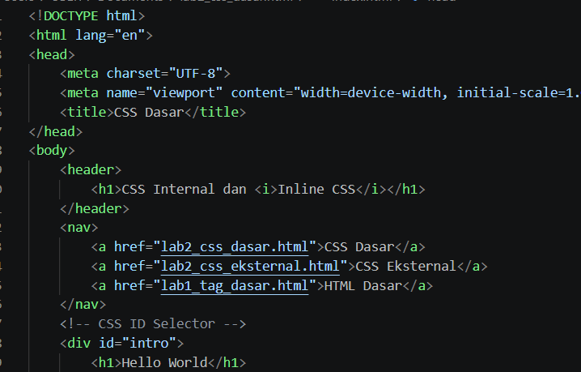
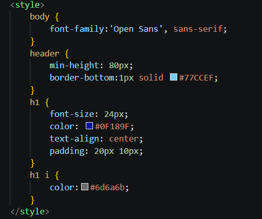
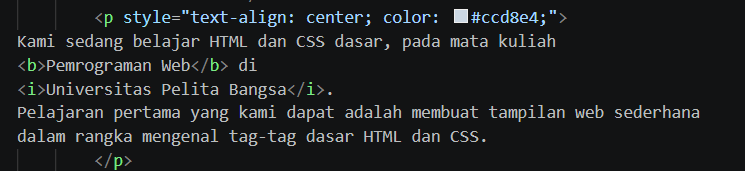
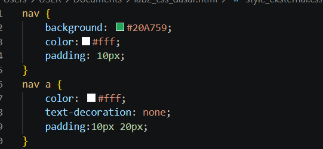
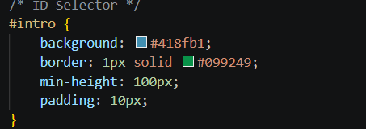
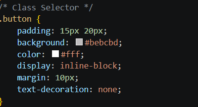
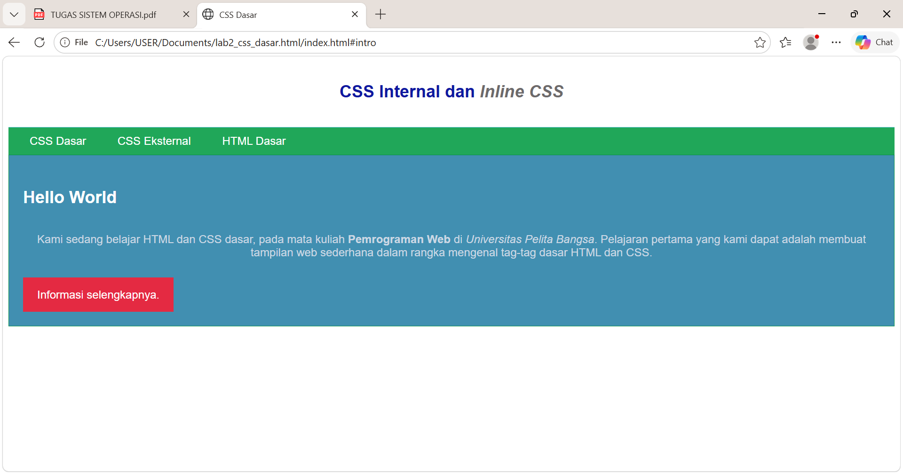

# Lab3Web
# Laporan Praktikum Pemrograman Web

## Praktikum 3: CSS Dasar

**Nama :** Alfi Iftihal Nurul Afiat  
**NIM :** 312510041  
**Kelas :** I251D 

---

# 1. Tujuan Praktikum

Praktikum ini bertujuan untuk:

1. Memahami konsep dasar CSS.
2. Memahami aturan penulisan CSS.
3. Memahami penggunaan selector sebagai pengontrol CSS.
4. Membuat pengaturan CSS pada dokumen HTML.

CSS (Cascading Style Sheet) digunakan untuk mengatur tampilan halaman web agar lebih terstruktur, menarik, dan mudah dikembangkan.

---

# 2. Dasar Teori

CSS merupakan bahasa yang digunakan untuk mengatur tampilan elemen HTML pada sebuah website.

Dalam CSS terdapat dua komponen utama yaitu:

## a. Selector

Selector digunakan untuk menentukan elemen HTML mana yang akan diberikan aturan CSS.

Contoh:

```css
h1 {
 color: blue;
}
```
# 3. Langkah-Langkah
## Langkah 1 - Membuat Repository GitHub
1. Membuka website GitHub.
2. Membuat repository baru dengan nama:
```Lab3Web```

3. Membuat file:
```README.md```

sebagai laporan praktikum.
## Langkah 2 - Membuat Dokumen HTML
Membuat struktur HTML dasar dengan elemen:
```- <html>
- <head>
- <body>
- <header>
- <nav>
- <div>
```
Contoh struktur:

## Langkah 3 - Menambahkan Internal CSS
CSS internal ditambahkan pada bagian <head> menggunakan tag ```<style>.```
Contoh:


Hasil:
- Mengubah jenis font.
- Mengubah warna teks.
- Mengatur posisi heading.
## Langkah 4 - Menambahkan Inline CSS
Inline CSS ditambahkan langsung pada elemen HTML.

## Langkah 5 - Membuat External CSS
Membuat file CSS terpisah:
```style_eksternal.css```

Kemudian menghubungkan dengan HTML:
```<link rel="stylesheet" href="style_eksternal.css">```

Contoh CSS:

## Langkah 6 - Menggunakan CSS Selector
## ID Selector
ID selector menggunakan tanda pagar ```(#).```


Pemanggilan:
```
<div id="intro">
</div>
```
## Class Selector
Class selector menggunakan tanda titik ```(.).```


Pemanggilan:
```
<a class="button">
Informasi
</a>
```

# 4. Hasil Praktikum
Tampilan hasil akhir

